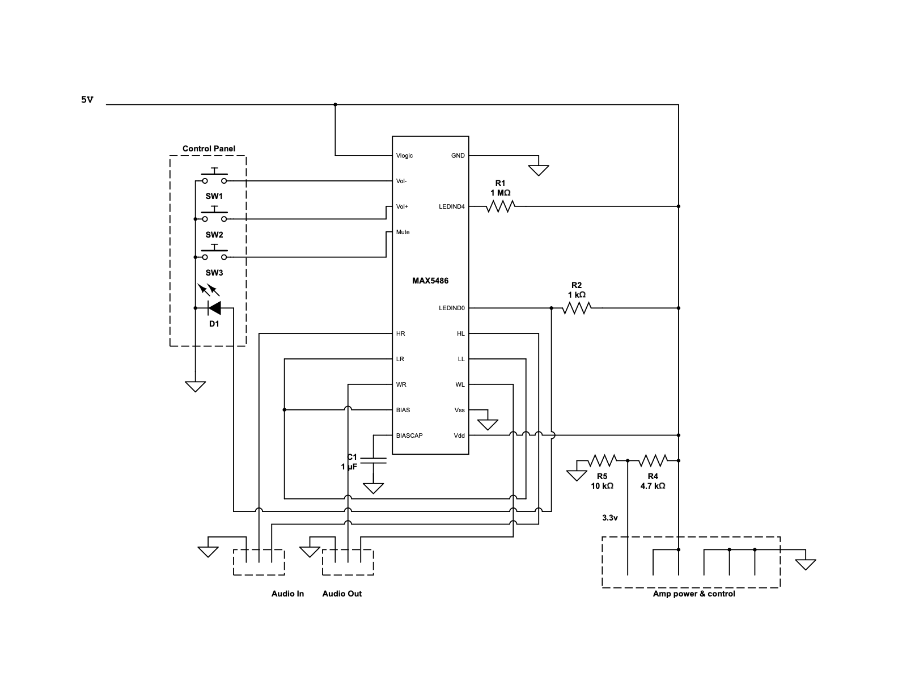

# HP Touchsmart IQ804 all-in-one PC conversion project

## Context
I found this all-in-one PC in a PC recycle bin long ago (circa 2014). It was used as a guest computer in my house for a while. Now it's way too old even for that purpose. HP Touchsmart IQ804 (marketed as IQ800) is an all-in-one PC released in 2008. It was originally equipped with Windows Vista and upgradable to Windows 7. I never tried but I doubt it'd be able to run Windows 10. There's no way it'd be able to run Windows 11. Instead of throwing it away, I decided to harvest as many components as I can. In particular, the 26 inch, 1920x1200 LCD panel is crispy clear and I really love it.

Disclaimer: as a professional software engineer, I am not well versed in electronics or hardware beyond the basics, especially analog stuff. So I'm not really sure if what I did was correct or optimal. But I haven't set anything on fire yet. If anyone reading this finds any mistakes, please leave a comment.

## Goal
Convert this all-in-one computer into an external display and docking station for laptops or smart phones, reusing as many components as possible.

Primary goals: 
* Have fun and learn something useful or completely useless along the way
* Reuse the display
* Reuse the speakers

Secondary goals:
* Charge the host through PD
* Reuse the microphones
* Reuse the webcam
* Reuse the volume control buttons
* Reuse the power switch button
* Add a USB 2.0 hub and connect it to IO panel ports
* Reuse the SD card reader
* Reuse the ambient LED light
* Provide an additional PD charging port (no data)

Non goals:
* Save money. It's cheaper to buy a monitor with all these features.

Components to be removed or ignored:
* Motherboard + GPU.
* CPU & GPU fans.
* Touchscreen. I don't really like touchscreens on computers.
* BT module. What laptop doesn't have built-in BT these days?
* CD drive. What is a CD?! It's probably a DVD drive. Not that it doesn't belong to the museum either.
* Hard drive.
* 1394 connector. Come on, it's 21st century!
* WiFi antennas.
* IR LED. The machine was supposed to come with a remote control, but I don't have it. What am I supposed to do with it anyway?
* Light sensor.
* Hot start key. Really not sure what it was.

## Disassembly
The first step is to open up the machine and disassemble the parts, reverse engineering some components if needed. I found [these instructions](disassembly.pdf) from HP which helped with the disassembling process.

## Interfaces with the host
As a design goal, the main interface with the host (computer or phone) would be a single USB-C connection. I have a few USB-C to HDMI adapters with downstream USB-A port(s) and pass-through charging. A couple of them have short (~10 cm) cables. But I want it to have a female port. I considered using a coupler. After doing some research, I realized that USB-C couplers are actually prohibited by USB spec, although such products exist on Amazon. I actually tried a couple of them and they only worked in one orientation. So I decided to use one with a detachable cable, [Anker 343](https://www.anker.com/products/a8372). It has two HDMI ports, two downstream USB-A ports, and one downstream USB-C port. I'm only using one HDMI and one USB-A, leaving plenty room for potential expansion.

Here's a diagram of how things are going to be connected.

```
                                              +-----------+
                                          +-->| LCD Panel |
              +------------------+  LVDS  |   +-----------+
              | Video Controller |--------+ 
              +------------------+  TRS   |    +------------+
                        ^                  +-->| Audio amps |
                        | HDMI                 +------------+
                        |
+------+   USB-C  +-----------+  USB-A  +-------------+
| Host |  <-----> | Anker 343 | <-----> | USB 2.0 hub |
+------+          +-----------+         +-------------+
                        ^                      ^
                        | PD             USB-A |   
               +-----------------+             |   +-------------+
               | 100W PD Charger |             +-->| Webcam      |
               +-----------------+             |   +-------------+
                                               +-->| Microphone  |
                                               |   +-------------+
                                               +-->| Card reader |
                                               |   +-------------+
                                               +-->| Keyboard    |
                                               |   +-------------+
                                               +-->| Mouse       |
                                               |   +-------------+
                                               +-->| Open port 1 |
                                               |   +-------------+
                                               +-->| Open port 2 |
                                                   +-------------+
```
* The upstream USB-C port is connected to the host.
* The HDMI port would be connected to the video controller, which provides the video signal to the LCD panel and the audio signal to the amps.
* The USB-A port would be connected to a downstream USB 2.0 hub for the peripherals and open USB ports.
* The PD-in port would be powered by a DC -> PD charging module.

In addition, I'm also providing a power only PD port (not shown in the diagram) so that one can charge an accessory.

## Display
The idea is to use a video controller to drive the LCD panel. There's quite a few video controllers out there. But this is a messy and gray area. Nothing is well documented. I did a lot of research on [this page](https://hackaday.io/project/179868-all-about-laptop-display-reuse) that provides a lot of info on reusing LDC panels, especially laptop panels.

Here's a summary of the LCD panel.
* Model: [CLAA260WU11](https://www.panelook.com/CLAA260WU11_CPT_25.5_LCM_overview_2842.html)
* Interface: LVDS (30 pin), 2 channel, 8 bit
* Backlight: CCFL
* Native resolution: 1920x1200

A daughter board provides the DC power (19 Volts) for the inverter. The inverter connector consists a bunch of Vcc and GND wires, connected directly to the 19V DC power. In addition, there is an ENABLE and a DIM pins, connected to the motherboard, for turning on the panel and controlling brightness. When the motherboard is powered on, I’m measuring ~4.4V on these pins.

For testing, I connected both ENABLE and DIM to a 5-Volt power supply and the panel lighted up properly. So I rewired them to the inverter output of the video controller. Note that I'm not using the 12V DC inverter output of the video controller, but rather using its originally DC power. The inverter doesn't seem to work with 12 Volts. And this configuration avoids rewiring.

For the video controller, I first ordred a PCB800862 controller. But I couldn’t get it to support 1920x1200. I think its firmware needed to be flashed. Then I ordered an M.MT68676.3, intended to be used for LM240WU2, which has the same resolution and is also 2 channels 8 bits, and it worked.

## Speakers
* There are 2 enclosures, one for the left channel and one for the right.
* Each enclosure contains 2 speakers. They seem to be identical.
* The 4 pins are the input of the 2 speakers.
* The enclosures are passive components, i.e. they contain no amps, since I measured a few ohms across the wires.
* The enclosures are connected to the daughter board, which has amps for the two channels.
* The audio output from the motherboard is fed to the daughter board through 10 wires.
* After some reverse engineering, I have found out the pinout of the output. 
  * The two 5-Volt pins are probably for current capacity. Both speakers still work if I disconnect either.
  * The audio outputs are single ended, with a bias voltage of ~1.62 volts.
  * Reverse engeineered pinout:

    | Color | Function | Color | Function |
    |-------|----------|-------|----------|
    |Yellow |5v	       |Orange |5v        |
    |Grey   |Left      |White  |Right     |
    |Black  |Shield/GND|Black  |Shield/GND|
    |Brown  |GND       |Black  |GND       |
    |Orange |3.3v	     |Red    |GND (wtf?)|

* To test the amps, I cut the wires and soldered one half to 2.5mm headers. Then I plugged them to a perf board and provide 5v, 3.3v, and audio signal.
* I took measurements of the current on both 5v and 3.3v. The 3.3v line has a constant current of ~60 μA, apparently not used for driving the speakers.
* The 5v line tops at 60mA when the volume is maxed out, although the nominal wattage of the speakers is 4W (800 mA).
* It was speculated that the 3.3v pin is used for controlling the volume. However, after probing with an oscilloscope, it didn’t seem to be the case. The waveform is a straight-line no matter how I adjust the volume in Windows. Instead, the amplitude of the signal changes. So I’m not sure what it is used for. But without it, the amps don’t work. It might be an ENABLE signal? My suspicion is that the motherboard would pull it low if earphones are plugged into the audio jack. I have no use for it so I'm going to fix it high.
* Instead of using regulated 3.3v, I’m simply using a voltage divider (100K + 47K) to get ~3.3v from 5v, thus eliminating a 3.3v regulator. Although I suspect 5V works too but I don't want to risk it.

## Microphones
The machine comes with 2 microphones. One left and one right. They are directly connected to the motherboard via a 5 pin connector. 

### Identification
The mics physically share the same PCB as the camera. The PCB has two clusters of wires coming out. One for the camera and one for the mics. The camera cluster has 4 wires: black, red, green, and white. They are connected to some pin headers on the motherboard. The color coding looks like a USB connection to me. So I soldered the wires to a USB-A plug and plugged it into a laptop and it worked fine.

Now the mics. I originally thought they were passive analog mics. The markings on the microphone are "AKU2004". I was not able to find too much information, other than that they might be digital microphones, designed for laptops. It makes sense that they are digital mics. It'd be too noisy to run 30 cm wires for mic level signals inside a computer.

I also looked up the motherboard and found that its audio codec is AD1984, which does support digital microphones. I booted the computer and inspected the pins. It turned out that 2 pins had perfect 2 MHz square waves and the other two had irregular sqare waves. So that confirmed that they are digital and the 2 MHz sqare waves must be clock signals. I had no idea about digital microphones. But some research on Google led me to believe they are MEMS microphones and the output is probably PDM (pulse density modulation) format. There are two popular formats. The other is I2S. PDM signals, once filtered with a 20 kHz low pass filter, should produce just analog signal. So I did just that and connected the signals to earphones. Sure enough, the output is audible. So that confirmed that the signal is PDM. The red wires are for the right microphone, BTW.

  

I also found [this doc](https://www.akustica.com/Files/Admin/PDFs/AN40-1%201%20AKU2002CH%20Mic%20Module%20Design%20Guide.pdf) and [this press release](https://tzjwinfcha.pixnet.net/blog/post/25040549) (in Chinese) which indicate that they are MEMS digital microphones.

Digital microphones are not passive components. I suspected they drew power from the camera’s USB port and the remaining 4 pins were clock and data for both mics. Sure enough, if the camera is not plugged in, the mics don’t work. So that confirmed my theory. The next step is to interface the PDM signals with USB.

Side note: laptop webcams usually run on 3.3V instead of 5. I forgot to take a measurement while the machine still bootet. So I don't know for sure if it was 3.3 or 5 originally. But when I powered it with 3.3V, both webcam and microphones worked, although 5V also worked. So I'm going with 3.3 to avoid shortening the life span of these devices.

### Sampling and Decoding
There are at least two ways to do this. The easiest is to low pass filter the output and convert it to analog, then feed it to a USB sound card. This should be super easy. But what's the fun in that?! Plus, I'm an engineer. Let's over engineer the hell out of it!

To generate the clock signal, I used PIO on RP2040 and made a small change to [this example](https://github.com/raspberrypi/pico-examples/tree/master/pio/squarewave). Then I connected an earphone to the PDM output. I also didn't use a low pass filter (rather, the earphone is the filter). The output is definitely audible and it resembles the sound picked up by the mics.

So, now I am trying to directly convert the PDM digital signal into USB data frames. Some searching led me to the first [important discovery](https://www.hackster.io/sandeep-mistry/create-a-usb-microphone-with-the-raspberry-pi-pico-cc9bd5) that converts a mono microphone into a USB microphone using a Raspberry Pi Pico. I tried it and it worked out of the box! I could hook up with one mic and call it good there. But I wanted to make use of both of the mics. I can either average the input of both or create a stereo mic. I suspect the latter is probably simpler.

I found that someone had tried a [mic array](https://github.com/CaydenPierce/MSA). I gave it a try, but the result was too noisy. Not sure what was happening. Then I decided to code it myself based on Sandeep's project.

### USB Interface
Now, to do that, I need to modify the code. First, I need to present the Pi Pico as a stereo mic. The project aforementioned uses [tinyusb library](https://github.com/hathach/tinyusb/) to turn the Pi Pico into a USB audio device. So I started looking into USB audio. Concepcts I learned along the way:

* Device Descriptors
* Configuration Descriptors
* Interface Descriptors
* Endpoint Descriptors
* Isochronous Transfer

Eventually, I changed the USB descriptor to present as a stereo mic. More details in the code linked below.

### Sampling both channels
In the hackster blog post aforementioned, the author Sandeep uses Pico's PIO to generate the clock signal at 1.024 MHz and sample the data pin once per clock cycle, or 16 times per milliesecond (16 kHz), then uses a soft PDM filter to down sample, filter, and produce 16 amplitude values, each a 16 bit signed integer. My changes include:

* Reading 2 bits (pins 3 and 4) instead of 1 in each clock cycle on a PIO statemachine.
* Connecting clock pins for both channels to pin 5.
* In the PDM filter, using some bit gymnastics to separate the left and right channels.
* In the PDM filter, filtering both signals. The filter is stateful and you can't call the filter function on both signals alternatively. It makes sense it's stateful since it needs neighbouring values to calculate frequencies.
* Generating USB frames for both channels. The 16-bit signed integer values representing the amplitude are alternating. I.e. one value for the left followed by one value for the right and repeat.

And [here](https://github.com/delingren/mems-mic/tree/stereo_no_encoding) is the code. It's hacky and hard coded. But it works. If anyone is reading this, don't use it as a library.

I did all the development and debugging with two Pi Picos, one as a debug probe. The final product uses an RP2040 board with a smaller footprint with fewer pins, since I only need 3 pins.

### References:
* [4-channel mic example](https://github.com/hathach/tinyusb/blob/master/examples/device/audio_4_channel_mic/src/usb_descriptors.c)
* [USB descriptors](https://www.beyondlogic.org/usbnutshell/usb5.shtml)
* [A USB audio tutorial](https://www.silabs.com/documents/public/application-notes/AN295.pdf)
* [USB microphone with a Pi Pico](https://www.hackster.io/sandeep-mistry/create-a-usb-microphone-with-the-raspberry-pi-pico-cc9bd5)
* [Pi Pico as a sound card](https://github.com/raspberrypi/pico-playground/tree/master/apps/usb_sound_card)
* [A more concrete example of using Pi Pico as a sound card](https://www.instructables.com/RP2040-USB-Sound-Card-Pulse-Density-Modulated-Audi/)
* [PDM filtering](https://www.st.com/resource/en/application_note/an5027-interfacing-pdm-digital-microphones-using-stm32-mcus-and-mpus-stmicroelectronics.pdf)
* [Audio codec data sheet](https://www.analog.com/media/en/technical-documentation/obsolete-data-sheets/AD1984.pdf)
* [Debugging Pi Pico](https://datasheets.raspberrypi.com/pico/getting-started-with-pico.pdf?_gl=1*11ism9o*_ga*MTIzODIxMTQ0OC4xNzE5OTU2NzM4*_ga_22FD70LWDS*MTcxOTk1NjczNy4xLjEuMTcxOTk1Njg1OC4wLjAuMA..)
* [Debug Probe Firmware](https://www.raspberrypi.com/documentation/microcontrollers/raspberry-pi-pico.html#:~:text=You%20can%20use%20one%20Raspberry,→%20SWD%20and%20UART%20converter.)
* [Final code](https://github.com/delingren/mems-mic/tree/stereo_no_encoding)

## Volume Control
I thought it'd be nice to be able to control the volume of the audio output. Apple devices don't support CEC, so they can't control the volume of the audio stream in the HDMI output signal. There're software solutions (e.g. [SoundSource](https://rogueamoeba.com/soundsource/)). But it'd be nice to be able to do it universally. The machine comes with three volume control buttons (up, down, and mute). After doing some research, I found this IC [MAX5486](https://www.analog.com/media/en/technical-documentation/data-sheets/MAX5486.pdf) that fits the bill. So I ordered a couple and some TSSOP24 to 2.5mm pinhead adpater. Soldering those pins was a challenge! It was about the smallest thing I could hand solder. A small iron and a chipsel tip definitely helped a lot.

Now, on to the volumn control buttons. They are mounted on a small PCB board, along with an LED for HDD. Remember those HDD activity indicators back in the days? They were on every computer, including laptops! I doubt anyone ever found them useful. Anyway, the PCB is connected to the motherboard with a 6 pin connector. I thought it'd be easy to wire up. I thought each button would just short two pins (or a pin to the ground). However, after some poking around, it appeared that there's some resistors and capacitors on the board, probably for debouncing. What's really strange is that only the vol+ button shorts a pin to the ground. The other two have a 20K ohm resistance to the ground when open and 10K when closed. Not sure what the deal is. The HDD LED is somewhat controlled by a BJT on board and requires a +5V power.

Instead of tweaking the circuit, I decided to rewire it such that all three buttons simply short a pin to the ground. MAX5486 does its own debouncing. I also removed the LED and replaced it with my own. I am planning to use it to indicate the mute state. MAX5486 supports indicating the sound level with 5 LEDs. When muted, all LEDs are off. So I just need to wire my LED to the pin for the lowest volume level, but reversing the logic. The LEDs are supposed to be wired between Vdd and the pins. When an LED is supposed to be turned on, the pin goes down to 0V. When an LED is supposed to be turned off, the pin goes up to 2.2V, just enough to turn off the LED (2.8V is below the voltage drop of an LED). But 2.2V to ground is not enough to drive an LED. So I'm pulling it up to 5V with a 1K resistor. When it's low, the LED is bypassed. When it's supposed to be 2.2V, it's pulled up and current goes through the LED.

Here's the final circuit for the volume control module. It takes in 5V DC power and audio input and outputs audio for the amps. It also passes through the 5V DC and generates 3.3V ENABLE signal for the amps. 



In the end, my schematic is slightly different from the recommended one in the datasheet. The audio output from the video controller is single ended instead of differential. I.e. one wire of each channel is tied to the ground. The recommended circuit connects it to BIAS, which worked perfectly fine in prototyping and testing, because I was using the output from a cell phone for testing, whose signals are effectively differential, since the phone and the volume control module don't share a ground. Once I wired up the video controller and the volume control module, and powered them with 12V and 5V DC, things started going haywire. The audio was distorted and crackling. I did a lot of head scratching and finally realized that I was effectively shorting BIAS to the ground, which was now shared. So I ended up connecting the input to the ground instead of BIAS. I'm not sure how much this impacted the amps. But this is not a high quality sound system anyway.

I used a solderable breadboard for the final volume control module and soldered the MCU for the microphones on it as well. Then I realised that I could've used the 3.3v from the MCU dev board for the amp instead of a voltage divider. Oh well.


Pinout:
* Upper row: 3.3V, 5V, 5V, GND, GND, GND; Out (Left, Right, GND)
* Lower row left: Vol-, Vol+, Mute, GND, LED-, LED+; In (Left, Right, GND)
* Lower row right: Mic (GND, CLK, R DAT, L DAT)

## Webcam
The webcam is a standard USB device, with wires correctly color labled. All I needed to do was soldering them to a USB connector. One caveat is that it's supposed to be powered by 3.3V. Although I do have a regulated 3.3V from the microphone MCU, it's a little inconvenient to run a wire. So I just used two diodes to drop ~1.5V. I soldered them in series in the Vcc wire. 


If I were to redesign everything, I would probably use a bigger breadboard for the volume control and microhpone MCU, and run the wires for the webcam and the microphones to the board and utilize the 3.3V on the MCU. Then I would have two USB connections coming out of that board for the webcam and microphones. 

## Ambient LED light
There's a strip of blue LEDs at the bottom of the display, illuminating the keyboard. It's controlled by a single button on the right side panel. There's a PCB with connections to a light sensoring LED and the motherboard. It seems to be a USB device. I suppose HP has a Windows driver that controls the light based on the ambient lighting. I have no use for the light sensoring LED or the USB port. So I simply discarded those cables and parts. When provided with 5V DC power, the LED and the control button work fine. Each time the button is pressed, it cycles through 3 levels of brightness. It's basically useless but it's also basically effortless.

## System fan
The original machine has a 12V 0.4A system fan that blows into the LCD panel inverter, in addition to two fans cooling the CPU and GPU. I don't have data on the inverter but a typical wattage of a CCFL inverter is ~5 Watts. I suppose running it at 5 Volts should be sufficient to dissipate the heat. I also want to turn it on only when the inverter is turned on. Therefore I am piggy-backing on the inverter's ENABLE signal from the video controller.

I have two options to control the fan using the ENABLE signal: MOSFET or relay. MOSFET is quieter and low profile. So I'm inclined to use a MOSFET. There are a few issues to address though.

* The ENABLE signal is 5 Volts. So I need a logic level MOSFET.
* 2N7000, a typical logic level MOSFET, has a resistance of ~5 Ohm when open. This is probably significant for a small motor.
* The inrush current when a motor starts is significantly larger than its running current. I need to make sure the current doesn't exceed the current rating of the MOSFET.

I have no means to measure the peak current. But 3x running current is a rule of thumb for estimating the inrush current. So I connected the fan to a 5-Volt source, in series with a 5.6 Ohm resistor, simulating the resistance of the MOSFET, and measured its running current. It measured ~65 mA. If we go by the 3x rule, the peak would be exactly at the 200 mA current rating of 2N7000, cutting too close. So I decided to put two 2N7000s in parallel, which should reduce the resistance as well.


## USB 2.0 ports
The original motherboard exposes a bunch of IO ports on the back (well, side, actually) panel, including 3 USBs, 1 S-Video, and some misc ports. It also has two front-panel (so to speak, it’s also on the side, lol) USB ports and two audio ports that are connected to the motherboard, and an SD card reader with a 1394 port.

All I am interested in is the USB ports. My USB hub has 7 ports. Internally, I’m using 2 for the USB mic and the camera. The card reader occupies another one. That leaves me with 4. I’m connecting two to the front panel ports and two to the back panel. Two of these four will be used for a keyboard and a mouse, leaving two free ones.

The front panel ports already have female USB 2.0 connectors. All I needed to do was to solder the wires to male connectors and to plug into the USB hub. The 3 back panel ports were on the motherboard. So they were just empty holes after removing the motherboard. Since I use only 2 of the holes for USB-A ports, I’m using the third for a type C PD port (no data, just power). It can be used for charging an accessory.

So I 3D printed this small holder that fits in the spot and hot glued it down in place. The female USB connectors are snugly pressed into the print and hot glued. Then I soldered wires to basically make them USB 2.0 extensions. The PD port is a USB-C extension cable. A 4th opening (originally for an RJ45 connector) is used for the main USB-C connection to the host.


## Power train
The machine comes with a 230 Watt, 19 Volt DC power adapter, in line with most old laptop power bricks. The connector is 7.4mm OD/5mm ID, used by many Dell and HP laptops. I have a couple of Dell and HP chargers in my drawer. I was debating between using an external power adapter and integrating one inside. But given the rather low profile of the machine, it's probably hard to find an adpater that could fit in. Heat dissipation is probably going to suffer as well. The original machine had 3 fans and I removed 2.

Since I want to charge the device, I'll need a PD charger and pass it through the USB to HDMI adapter.

### Voltages and budget
* The USB to HDMI adapter reserves 15W for itself. But I'm only using one HDMI port and one USB-A down stream port. The down stream USB hub is self powered. So 5W should be more than enough.
* The CCFL inverter runs directly on 19V. I tried 12V and it wouldn't power up. I didn't try anything in between. I don't know the spec of the inverter. But a quick Google search tells me a typical CCFL inverter is 3-5 Watts. Let's be conservative and call it 10W.
* The video controller runs on 12-15V. So I can't feed it the 19V directly. I'll need a 12V rail. The spec calls for a 12V 3A power adapter. So, that's 36W, which is probably very conservative.
* Everything else runs on 5V: all USB 2.0 devices, system fan, ambient LED light, and speakers. The 7 USB 2.0 ports are all standard downstream ports (SDPs). So each can draw up to 100 mA. The fan draws 65mA based on my measurement. The LED light should draw no more than 50mA. According to the specs, the speakers top out at 4W. So that's ~8W on the 5V rail.

All in all, we are looking at 114W, plus some loss in voltage conversion. Let's say the overall efficiency is 85%, we will need a 134W input, which is very conservative. The original power adapter is way more than enough. The excess can be used for a power only PD port.

### 5V Rail
For the 5V rail, I'm using a Plolu 5V 3.2A step down regulator [D36V28F5](https://www.pololu.com/product/3782), more than enough than the power budget. Physical connections:
* Volume control module, which also passes power to the amps.
* USB hub
* Ambient light LED
* System fan (switched)

### 12V Rail
For the 12V rail, I'm using a Pololu 12V 2.4A step down regulator Regulator: [D36V28F12](https://www.pololu.com/product/3786), which is a little less than the spec of the video controller but I'm not powering the inverter through the video controller. And it's been running fine so far.

### PD charging
Originally, I purchased a 65W PD module from aliexpress that takes a DC input and outputs USB PD. However, I encountered some random issues. Sometimes, my laptop (MacBook) would go haywire, disconnecting and connecting again repeatedly. Sometimes, the USB hub would not power up. After testing with a bunch of devices under different conditions, and some head scratching, and then some measurements with a PD power meter, I suspected that it was because of the voltage of my power supply, which is ~19 volts. The PD module does not boost the voltage, it only steps down. However, when the device requests 20 volts, it happily complies and provides only 19 volts, minus the voltage drop on the chip itself, which ends up being just ~18. According the PD spec, the voltage tolerance is 5%, or 1 volt for the 20-volt PDO. So it works fine as long as the PDO is 15V or under. It’d work fine for phones and laptops with rather full batteries, but not ones that are aggressively charging or power hungry. So I have a few options.
* Use a power supply with a slightly higher voltage. Cons: I don't have a power supply with higher than 20 volt output; it also could cause damage to the CCFL inverter which is directly connected to the input. 
* Boost the 19 volts to ~21 before feeding it to the PD module.
* Find a PD module that provides up to 15 volts, limiting the charging power to 45 watts (3A is the current limit of 15V, according to PD specs). But I can’t seem to be able to find such a thing.
* Use a PD module that boosts the input to 20 volts if necessary. This seems to be the most reasonable and least complicated solution. 

For the last option, I found a few items on Amazon, directly shipped from China. They don’t have clear descriptions and specs and the ratings are in the mid 3s. So I decided not to take the risk. Eventually, I found this [SlimQ DC to PD extender](https://slimq.life/products/dc-to-usb-extender-for-150w-240) which seems much more reputable. It comes with 2 USB C ports that support PD and 2 USB A ports for QC. I could use this unit for 12V using a PD trigger (it does support 12V, which is optional in PD specs) and 5V too. But I already soldered and wired the 12V and 5V regulators. Plus, it’s less complicated this way, and I have an extra PD port that can be exposed for charging accessories.

### Power switch
The original power switch on this machine is a pushbutton that shorts a pin to the ground on the motherboard to turn on the machine. I am hooking it up with this [electronic switch](https://www.pololu.com/product/2813).

### Indicator LEDs
The switch assembly also has a couple of LEDs, one yellow and one green. I suppose they are for standby and on states. I was going to reuse the LEDs. However, their anodes are hard wired to one of the leads of the pushbutton, which is supposed to be the ground. This wouldn't work with the electronic switch, which needs two standalone wires, instead of ground, for the pushbutton. So I desoldered the LEDs and hot glued my own SMD LED on the board and soldered its leads to the connector. All in all, this module has 4 outgoing wires: 2 for the pushbutton and 2 for the LED. The LED is connecte to the output of the 5V regulator via a 56 Ohm resistor.

### Side note on power consumption
Out of curiosity, I used a USB power meter to measure some of the USB 2.0 devices I'm connecting to the USB hub, and measured their power consumption. And here's my findings.

* Raspberry Pi Pico: 30mA
* Card reader: 50mA when actively reading and writing
* Webcam: 90mA when active
* Wired mouse: 50mA
* Logitech mouse/keyboard dongle: 25mA
* Mechanical keyboard (powered by an Atmel mega32u4): 30mA

## Physical installation
There's a metal sheet on the back of the LCD panel. The motherboard and all other original components were installed on the sheet. I don't want to drill and tap it, so I mounted everything with double sided foam tapes and hot glue. I 3D printed standoffs for all the PCBs to keep them off the metal. For anything that generates heat (DC -> PD adapter & HDMI -> USB-C adapter), I used heat conducting tapes to help with heat dissipation.

The upstream USB-C port and charging port are exposed via USB-C extension cables. Technically USB-C extension cables are not USB-C spec compliant. But I've been using these cables for years for my WFH setup and haven't had any issues.


## End result

I'm pretty happy with the end result:


The keyboard and the touchpad in the picture were salvaged from laptops.

In summary, here's the list of fully functional features.
* USB-C interface with 85W PD charging
* 1920x1200 60 Hz LCD display
* Stereo speakers
* Stereo microphones
* Webcam
* SD card reader
* Keyboard
* Mouse
* 2 open USB 2.0 ports 
* Volume control
* Ambient LED light
* Power switch and indicator
* Extra 100W PD charging port

Devices tested
* MacBook Pro 2019 (Intel)
* MacBook Pro 2021 (M2)
* HP Envy x360
* Lenovo Yoga 9 (no PD charging)
* Alienware M15 R5 (no PD charging)
* iPhone 15
* Samsung Galaxy S8 (Dex mode)
