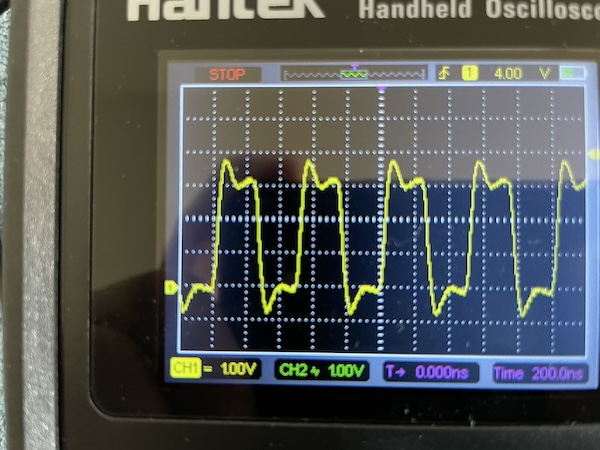

# HP Touchsmart IQ804 conversion project

## Context
HP Touchsmart IQ804 (marketed as IQ800) is an all-in-one PC released in 2008. It was originally equipped with Windows Vista and is upgradable to Windows 7. I never tried but I doubt it'd be able to run Windows 10. There's no way it'd be able to run Windows 11. Instead of throwing it away, I decided to harvest as many components as I can. In particular, the 26 inch, 1920x1200 LCD panel is crispy clear and I really love it.

## Goal
Convert this all-in-one computer into an external display and docking station, reusing as many components as possible.

Mandatory goals: 
* Reuse the display
* Reuse the speakers

Optional goals:
* Power switch
* System fan (for cooling the inverter)
* Webcam
* Microphones
* USB 2.0 hub
* CF card reader
* Ambient light
* Volume control
* Charging through PD
* Touchscreen

Components to be removed or ignored:
* Motherboard + GPU
* CPU & GPU fans
* BT module
* CD drive
* Hard drive
* 1394 connector
* WiFi antennas
* IR led
* Light sensor
* Hot start key

## Display
* Model: [CLAA260WU11](https://www.panelook.com/CLAA260WU11_CPT_25.5_LCM_overview_2842.html)
* LVDS (30 pin), 2 channel, 8 bit, CCFL
* Native resolution 1920x1200
* The daughter board provides the DC power (19 volts) for the inverter.
* The inverter connector consists a bunch of Vcc and GND wires, connected directly to the 19V DC power. In addition, there are an EN and a DIM pins, connected to the motherboard. When the motherboard is powered on, I’m measuring ~4.4v on these pins.
* I connected both EN and DIM to +5v DC and the panel lighted up properly. So I rewired them to the inverter output of the video controller. Note that I'm not using the 12v output of the inverter output of the video controller.
* The controller I have in mind is PCB800862. Update: I got the controller but couldn’t get it to support 1920x1200. I ordered another one designed for LM240WU2, which has the same resolution and is also 2 ch 8 bit.

## Speakers
* There are 2 enclosures, one for the left channel and one for the right.
* Each enclosure contains 2 speakers. They seem to be identical.
* The 4 pins are the input of the 2 speakers.
* The enclosures are passive components. I.e. they contain no amps.
* The enclosures are connected to the daughter board, which has amps for the two channels.
* The audio output from the motherboard is fed to the daughter board through 10 wires.
* After some reverse engineering, I have found out the pinout of the output. 
  * The two 5v pins are probably for the current capacity. Both speakers still work if I disconnect either.
  * The audio outputs are single ended, with a bias voltage of ~1.62 volts.
  * Reverse engeineered pinout:

    | Color | Function | Color | Function |
    |-------|----------|-------|----------|
    |Yellow |5v	       |Orange |5v        |
    |Grey   |L+        |White  |R+        |
    |Black  |L-        |Black  |R-        |
    |Brown  |GND       |Black  |GND       |
    |Orange |3.3v	     |Red    |GND (wtf?)|

* See some discussion on this [reddit thread](https://www.reddit.com/r/AskElectronics/comments/1d7cm2i/comment/l71as52/?context=3).
* To reuse the amps, I cut the wires and soldered one half to 2.5mm headers. Then I plugged them to a perf board and provide 5v, 3.3v, and audio signal.
* I took measurements of the current on both 5v and 3.3v. The 3.3v line has a constant current of ~60 μA, apparently not used for driving the speakers.
* The 5v line tops at 60mA when the volume is maxed out, although the nominal wattage of the speakers is 4W (800 mA).
* It was speculated that the 3.3v pin is used for controlling the volume. However, after inspecting it with an oscilloscope, it didn’t seem to be the case. The waveform is a straight-line no matter how I adjust the volume. Instead, the amplitude of the signal changes. So I’m not sure what it is used for. But without it, the amps don’t work. It might be an enable pin?
* Instead of using regulated 3.3v, I’m simply using a voltage divider (100K + 47K) to get 3.3v from 5v, thus eliminating a 3.3v regulator. Although I suspect 5v works too but I don't want to risk it.

## Power source
I'm reusing the 230 Watt, 19 Volt DC power adapter. The connector is 7.4mm OD/5mm ID, used by many Dell and HP laptops. I have a couple of Dell and HP chargers in my drawer. What's more, most old laptop chargers are ~19v and USB PD is 20. So it's easy to replace the power adapter if it breaks.

The video controller uses 12-15 Volt DC. So I can't feed it the input directly. I also need 5 Volts for the amps for the speakers as well as the powered USB hub and ambient LED light. I'm using a Pololu 12V 2.4A step down regulator and a Plolu 5V 3.2A step down regulator. The speakers are 4 Watts (0.8A). My USB hub has 7 ports but I'm plugging a Pi Pico, the webcam, the card reader and the touchscreen. All of them cannot draw more than 1A, if that. I'm only exposing two ports to the outside. So that should be plenty. Not to mention the host computer will also supply at least 500 mA.

TODO: measure actual current of these devices using a USB power meter.

## Power switch
The original power switch on this machine is a pushbutton that shorts two pins on the motherboard to turn on the machine. The switch assembly also has a couple of LEDs, one yellow and one green. I suppose they indicate standby and on states. I'm connecting the pushbutton to a [Pololu Pushbutton Switch](https://www.pololu.com/product/2812) to control the main power. The video controller has two LEDs for standby and on as well. I'm going to rewire them to the switch.

## System fan

## Volume Control
It'd be nice to be able to control the volume of the audio output. Apple devices don't support CEC, so they don't control the volume of the audio stream in the HDMI output signal. There're software solutions (e.g. [SoundSource](https://rogueamoeba.com/soundsource/)). But it'd be nice to be able to do it universally. The machine comes with three volume control buttons (up, down, and mute). After doing some research, I found this IC [MAX5486](https://www.analog.com/media/en/technical-documentation/data-sheets/MAX5486.pdf) that might fit the bill. So I ordered a couple and some TSSOP24 to 2.5mm pinhead adpater. Soldering those pins will be a challenge!

And on the volumn control buttons... They are mounted on a small PCB board, along with an LED for HDD. Remember those HDD activity indicators back in the days? They were on every computer, including laptops! I doubt anyone ever found them useful. Anyway, the PCB iss connected to the motherboard with a 6 pin connector. I thought it'd be easy to wire up. I thought each button would just short two pins (or a pin to the ground). However, after some poking around, it appeared that there's some resistors and capacitors on the board, probably for debouncing. What's really strange is that only the vol+ button shorts a pin to the ground. The other two have a 20K ohm resistance to the ground when open and 10K when closed. Not sure what the deal is. The HDD LED is somewhat controlled by a BJT on board and requires a +5V power.

Instead of tweaking the circuit, I decided to rewire it such that all three buttons simply short a pin to the ground. MAX5486 does its own debouncing. I also removed the LED and replaced it with my own. I am planning to use it to indicate the mute state. MAX5486 supports indicating the sound level with 4 LEDs. When muted, all LEDs are off. So I just need to wire my LED to the pin for the lowest level, but reverse the logic (i.e. wire the LED between Vcc and the pin, instead of the pin and ground).

## Microphones
* The machine comes with 2 microphones. One left and one right. They are directly connected to the motherboard via a 5 pin connector. Physically, they share the same PCB board as the webcam.
* One of the 5 pins is the shield/ground. So I thought the 4 wires are the output of the analog microphones. However, it doesn’t seem to be the case. When I connect a pair to an oscilloscope I’m not getting any signal. So my guess is that the output is digital, which makes sense. Running mic level analog signals along 30 cm wires inside a computer is probably too noisy.
* Then I found this [doc](https://www.akustica.com/Files/Admin/PDFs/AN40-1%201%20AKU2002CH%20Mic%20Module%20Design%20Guide.pdf) and [this](https://tzjwinfcha.pixnet.net/blog/post/25040549) (in Chinese) which indicate that they are MEMS digital microphones.
* Digital microphones are not passive components. I suspected they drew power from the camera’s USB port and the remaining 4 pins were clock and data for both mics. Sure enough, if the camera is not plugged in, the mics don’t work. So that confirmed my theory. That's also why I didn't get reading in the previous step.
* Two pins have square waves whose width is about 500 ns (2 MHz) and amplitude about 3.3v. These are very likely clock pins.

  

* The other two pins output irregular square waves. I suspected they were PDM encoded, as it’s a common format (along with I2S). To verify this, I need to produce a 2 MHz clock signal, hook up a low pass filter on the data pin, and inspect the output. 
* To generate the clock signal, I used PIO on RP2040 and made a small change to [this example](https://github.com/raspberrypi/pico-examples/tree/master/pio/squarewave). Then I connected an earphone. I also didn't use a low pass filter (rather, the earphone is the filter). But the Speakers definitely resembles the input.
* To interface the mics with the computer, I use a RP2040 as a soundcard. And I found [this project](https://www.hackster.io/sandeep-mistry/create-a-usb-microphone-with-the-raspberry-pi-pico-cc9bd5) that basically does what I need. 
* TODO: either make it stereo or average the two inputs. Someone has tried a [mic array](https://github.com/CaydenPierce/MSA). However, the result is too noisy. Not sure what's happening.
* References:
    * https://www.instructables.com/RP2040-USB-Sound-Card-Pulse-Density-Modulated-Audi/
    * https://github.com/raspberrypi/pico-playground/tree/master/apps/usb_sound_card
    * https://github.com/tierneytim/Pico-USB-audio/tree/main
    * https://www.st.com/resource/en/application_note/an5027-interfacing-pdm-digital-microphones-using-stm32-mcus-and-mpus-stmicroelectronics.pdf
    * Codec data sheet: https://www.analog.com/media/en/technical-documentation/obsolete-data-sheets/AD1984.pdf

## USB 2.0 Hub
I need a hub to connect the Pi Pico (acting as a soundcard), the webcam, the touchscreen, and the CF card reader. So I ordered a 7 port hub circuit from aliexpress. It has its own 5V DC power. I am also going to connect another USB hub and the 2 open USB ports to it. The second USB hub will be physically installed at the location of the motherboard, expsing 3 ports to the outside through the cutout of the panel. Two ports can be used for a keyboard and a mouse.
